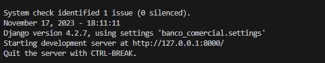

# Banco_Comercial

## Passo a Passo

```
pipienv install
cd ./banco_comercial

```

### Criar um admin

```
python manage.py createsuperuser
```

### Rodar o servidor

```
python manage.py runserver
```

*Log que o servidor iniciou com sucesso*


### Entre no localhost
- Devera abrir a tela inicial do banco


### links 

* locahost:8000/admin
* http://locahost:8000/user/login/
* http://locahost:8000/user/cadastro/
* http://locahost:8000/client/saldo/
* http://locahost:8000/client/extrato/
* http://locahost:8000/client/investir/
* http://locahost:8000/client/cartoes/